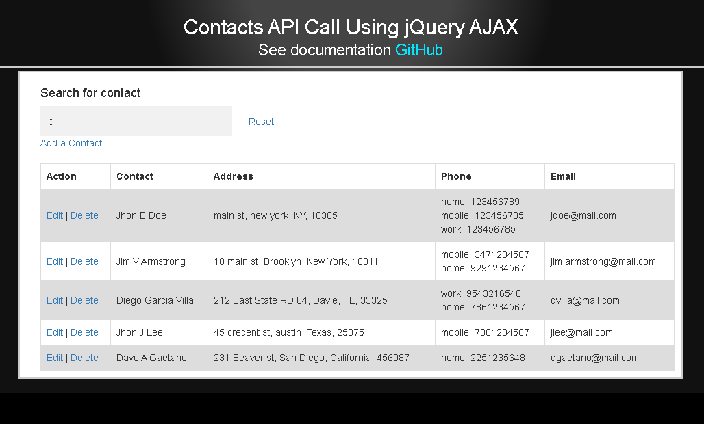
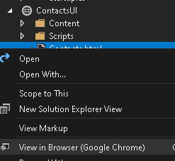

## Environment:
- .NET version: 3.1

## Routes
GET
/contacts
List all contacts

GET
/contacts/{id}
Get a specific contact

POST
/contacts
Create a new contact

PUT
/contacts/{id}
Update a contact

DELETE
/contacts/{id}
Delete a contact

SWAGGER
/swagger

## Data:
SQLITE                                               
Database attached as part of the solution in the ContactAPI project
The name is Contacts.db
For sample purposes the structure is split up in diferent tables in an attempt to match the json format
This design could be improved by denormilizing it to make CRUD operations more simple.

## Sample data:
{
  "id": 20,
  "name": {
    "first": "Harold",
    "middle": "Francis",
    "last": "Gilkey
  },
  "address": {
    "street": "8360 High Autumn Row",
    "city": "Cannon",
    "state": "Delaware",
    "zip": "19797"
  },
  "phone": [
    {
      "number": "302-611-9148",
      "type": "home"
    },
    {
      "number": "302-532-9427",
      "type": "mobile"
    }
  ],                                                                                  
  "email": "harold.gilkey@yahoo.com"
}                                                                                                                                                                                                                                      

## Architecture:                               
Contacts DB API endpoints perform CRUD operations to manage Contacts using SQLITE and entity framework.

## Testing
XUnit tests attached

## Documentation
Swagger documentation avialable at http://localhost:5000/swagger/index.html (Default endpoint)

## Server
Uses Kestrel and runs on localhost:5000

## Contacts UI
Separate user interface site built with JQUERY AJAX to use the API
Contact.html acts as a single page application that performs CRUD operations using a grid
Uses JQUERY, CSS, Bootstrap only
Requires Contact API siteto be running on localhost:5000

## Instructions on how to run it
1)Open solution with Visual Studio

2)Make sure Origin Environment variable is correctly set up for the environment to prevent CORS errors

3)Right click on contacts.html on the Contacts UI site and select "View on Browser" context menu option

## Filter Contacts using Autocomplete
You can search for contacts by first name and filter the grid when a selection is made

##  Add contact
You can add a contact by clicking on "Add Contact".
This will open a modal pop-up with the form fields
Once fields are entered, click submit to save the new contact

##  Edit contact
You can edit a contact by clicking the "Edit" link on the Actions Grid Column.
This will open a modal pop-up with the form fields and existing values.
Once fields are updated, click submit to update the contact.

##  Delete contact
You can delete a contact by clicking the "Delete" link on the Actions Grid Column.
This will send a request to the API to delete the contact on the server.
                                                                                  
